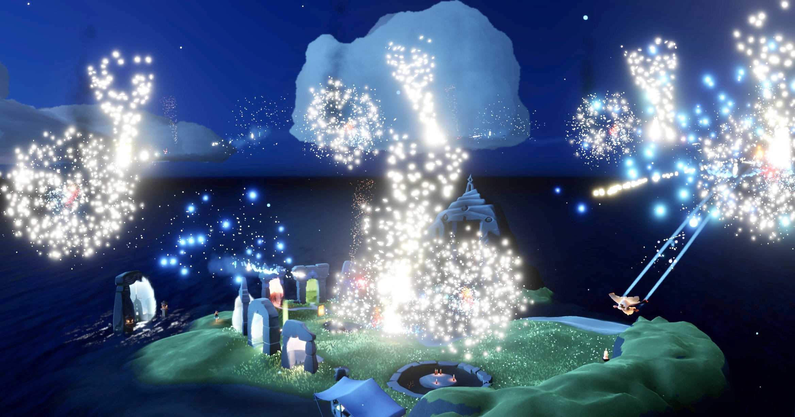
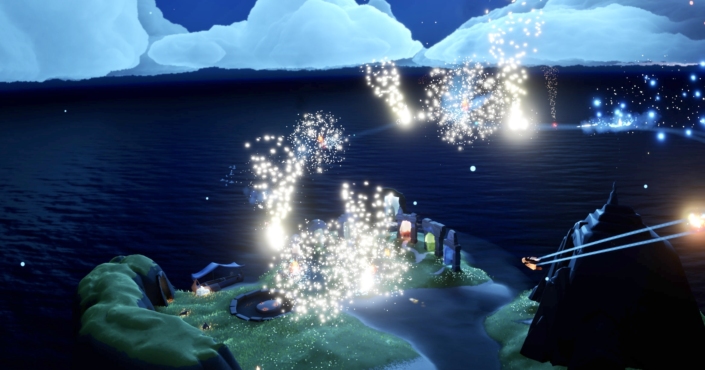

# Sky QoE Mod Research

<p align="center">
  
  
</p>

这是 Sky 非正式 QoE 模组的持续研究工作区，当前目标包括稳定读取本地玩家状态、提供内置调试菜单，并逐步识别场景实体与 QoE 功能入口喵。

## 当前环境

- 当前游戏进程名为 `Sky.exe`，安装路径为 `G:\GGames\Steam\steamapps\common\Sky Children of the Light\Sky.exe` 喵。
- 当前 `Sky.exe` 磁盘文件大小为 `43,579,608` 字节，最后修改时间为 `2026-07-18 00:54:55` 喵。
- 当前内存映像基址为 `0x140000000`，PE `SizeOfImage` 为 `0x2FB2000`，PE 时间戳为 `0x6A582C8E` 喵。
- `Sky_dump.bin` 是从模块基址导出的内存布局映像，大小为 `0x2FB0000`，仅缺 PE 声明映像末尾的 `0x2000` 喵。
- `Sky_full_dump.bin` 是带零洞的连续虚拟地址区间，文件起始 VA 为 `0xAFF61000`，其中 `Sky.exe` 位于文件偏移 `0x9009F000` 喵。
- 当前 Cheat Engine 版本为 `7.7.0.10621`，进程名为 `cheatengine-x86_64-SSE4-AVX2.exe` 喵。

## 已确认函数

以下地址均为当前游戏版本的 RVA，运行时地址需要加 `Sky.exe` 模块基址喵。

| RVA | 暂定名称 | 已确认行为 |
| --- | --- | --- |
| `0x1696910` | `GetLocalAvatar` | 从玩家管理器的固定槽位池中选择活动 Avatar 喵 |
| `0x15FBA00` | `GetOutfitResourceName` | 获取指定穿搭槽位的有效 ID，并将 ID 解析为资源名喵 |
| `0x15FA840` | `GetEffectiveOutfitId` | 在基础 ID、临时覆盖 ID 和回退穿搭之间选择有效 ID 喵 |
| `0xD0EEF0` | `FindOutfitRecord` | 通过 32 位 ID 在穿搭数据库哈希表中查找大小为 `0xE50` 的记录喵 |
| `0xD0EEB0` | `GetOutfitRecordName` | 返回穿搭记录中 MSVC `std::string` 保存的资源名喵 |
| `0xD0F0D0` | `FindOutfitByName` | 用资源名的 64 位 FNV-1a 哈希在穿搭数据库名称索引中查找并返回 32 位穿搭 ID 喵 |
| `0x15FCE70` | `ApplyOutfitId` | 应用单个槽位 ID、卸载旧模型并加载新服饰资源喵 |
| `0x15FD3C0` | `SetOutfitByName` | 参数约为 `(Outfit*, slot, name, 0, false)`，先按名称查找 ID，再应用并刷新角色模型喵 |
| `0x7868E0` | `PrintCurrOutfit` 回调 | 获取本地 Avatar 的 outfit，并查询槽位 `0,3,6,2,1`，但没有稳定日志输出喵 |
| `0x786FD0` | `ClearOutfit` 回调 | 获取本地 Avatar 后跳转到 outfit 清理函数喵 |
| `0x13F88C0` | `Game::AddChatMessage` | 游戏显示/接收聊天消息的入口，v0.6.1 在此捕获文本、来源和频道喵 |
| `0x10E1670` | `Game::OnKeyboardComplete` | UI/网页输入的高层入口，可能创建异步回调；模组不直接调用喵 |
| `0x13F7C50` | `Chat::SubmitMessage` | 高层入口完成过滤后的同步提交路径，会先把文本复制进聊天子系统记录喵 |

## 玩家与穿搭结构

玩家管理器包含最多约 60 个固定大小槽位喵。

| 对象 | 偏移 | 含义 |
| --- | --- | --- |
| Manager | `+0x30 + index*0x10B20` | 第 `index` 个 Avatar 地址喵 |
| Manager | `+0xB880 + index*0x10B20` | 第 `index` 个 Avatar 活动字节喵 |
| Avatar | `+0x18` | 玩家变换对象指针喵 |
| Avatar | `+0x58` | outfit 对象指针喵 |
| Avatar | `+0xB850` | 活动字节喵 |
| Avatar | `+0x109EC` | 状态标志，`GetLocalAvatar(..., true)` 只接受 `0x08` 位为 1 的 Avatar；`flags=0x1AC` 是有效候选喵 |
| Outfit | `+0x08` | Avatar 反向指针，此关系由 `GetEffectiveOutfitId` 明确使用喵 |
| Outfit | `+0x10` | 穿搭资源数据库指针喵 |
| Outfit | `+0x44` | 控制回退穿搭选择的状态字段喵 |
| Outfit | `+0x48` | 回退穿搭对象指针喵 |
| Outfit | `+0x54 + slot*4` | 10 个基础穿搭 ID 喵 |
| Outfit | `+0x1D48 + slot*4` | 10 个临时覆盖 ID 喵 |
| Outfit | `+0x1D7C + slot*4` | 10 个临时覆盖启用字段喵 |

玩家变换对象中，`+0x00` 与 `+0x10` 保存两份同步位置，`+0x50`、`+0x60`、`+0x70` 分别保存右、上、前三个方向基向量喵。

## 穿搭槽位枚举

枚举顺序来自运行时注册表 `OutfitSlotType` 喵。

| 槽位 | 名称 |
| --- | --- |
| `0` | `Body` 喵 |
| `1` | `Wing` 喵 |
| `2` | `Hair` 喵 |
| `3` | `Mask` 喵 |
| `4` | `Neck` 喵 |
| `5` | `Feet` 喵 |
| `6` | `Horn` 喵 |
| `7` | `Face` 喵 |
| `8` | `Prop` 喵 |
| `9` | `Hat` 喵 |

## 穿搭数据库布局

| 偏移 | 含义 |
| --- | --- |
| `+0x5080` | 哈希表哨兵节点指针喵 |
| `+0x5090` | 桶数组指针，每个桶占 `0x10` 字节喵 |
| `+0x50A8` | 桶掩码，使用 `hash & mask` 选桶喵 |
| `+0x50C0 + index*0xE50` | 穿搭记录数组喵 |
| Record `+0x00` | 32 位穿搭 ID 喵 |
| Record `+0x08` | 32 位槽位枚举喵 |
| Record `+0x10` | MSVC `std::string` 资源名喵 |

资源名到槽位 ID 使用 32 位 FNV-1a：offset basis 为 `0x811C9DC5`，prime 为 `0x01000193` 喵。

数据库用 ID 选桶时另做 MurmurHash3 finalizer：依次执行 `x ^= x>>16`、乘 `0x85EBCA6B`、`x ^= x>>13`、乘 `0xC2B2AE35`、`x ^= x>>16` 喵。

`FindOutfitByName` 内部还有一套 64 位 FNV-1a 名称索引，该哈希不能截断后当成槽位保存的 32 位穿搭 ID 喵。

## 当前验证状态

- 静态反汇编、槽位枚举和数据库算法已经完成喵。
- 菜单使用 `Avatar+0x58 == Outfit`、`Outfit+0x08 == Avatar`、active、`flags&8` 与数据库指针联合校验，并以每次 8 MiB 的预算分片扫描可读私有内存喵。
- CE Bridge 已安装到 `C:\Program Files\Cheat Engine\autorun\codex_bridge.lua`，并已连接当前 CE 7.7 实例喵。
- CE Bridge 已验证正常返回、`print` 捕获、Lua 错误堆栈、语法错误和连续多次连接喵。
- CE 7.7 的断点唯一句柄是 `debug_setBreakpoint` 返回的完整信息表，只有将该表交给 `debug_removeBreakpointByID` 才能精确删除喵。
- `2026-07-23 15:25` 的实机验证确认旧判定把 `flags&8` 方向写反，导致捕获器连续命中 256 次后以异常码 `0x4001000A` 退出；默认流程不再依赖调试断点喵。
- `SkyQoEMenu.dll` v0.1.1 提供完整快照 JSON 导出，CE Bridge 可用 `sky_menu_snapshot.lua` 读取 Avatar、Outfit、数据库、10 个槽位和坐标候选喵。
- v0.1.1 实机自动发现会额外要求 active=`1`、Outfit 不在 Avatar 内嵌范围、数据库不在 Outfit 内嵌范围、哈希表头可读且至少一个有效 ID 能解析到资源名，以排除偶然双向指针伪结构喵。
- v0.1.1 已连续三次稳定读取同一对象链，10/10 槽位均解析出与 `Body, Wing, Hair, Mask, Neck, Feet, Horn, Face, Prop, Hat` 对应的资源名，运行时地址只作当次验证样本而不能硬编码喵。
- v0.2.0 在玩家页加入统一距离输入与前、后、左、右、上、下六向精准位移控件；平面方向按角色朝向计算，上下固定使用世界 Y 轴喵。
- 精准位移会实时重读变换对象、校验方向基与目标坐标，同步写入两份位置；任一写入失败都会恢复原值喵。
- v0.2.0 已在实机完成前后、左右、上下各 5 厘米成对测试，六次调用全部成功，平面与垂直坐标变化正确且最终精确回到起点喵。
- 同名 DLL 热卸载重载后必须完整刷新 CE 符号处理器再调用导出；`sky_menu_snapshot.lua` 已内置该刷新，避免旧地址导致目标进程异常退出喵。
- 所有 RVA 都属于当前 `0x6A582C8E` 构建，后续版本必须先校验 AOB 或重新定位喵。
- `SkyQoELoader.exe` 已完成首次注入和同进程安全重载实测，两个路径退出码均为 `0`，重载后 Sky 保持响应且 `/health` 返回 `buildSupported=true`、`stateValid=true` 喵。
- `SkyQoEMenu.dll` v0.4.0 已加载游戏自带的 1536 项完整服饰目录，并在实机完成 Body 索引 `16 -> 17 -> 16` 的更换与恢复测试，两次应用成功、失败为 0 且 Sky 保持响应喵。
- `SkyQoEMenu.dll` v0.4.1 在更衣页增加仅针对 `internal_name` 的全局搜索，筛选本身不排队换装喵。
- `SkyQoELoader.exe` v0.5.0 提供常驻 Win32 窗口，每秒检测 Sky、入口地址和菜单状态，并分别提供首次注入与安全重载按钮喵。
- `SkyQoEMenu.dll` v0.6.1 将外部 API 扩展到环境、实体、房间成员、TGCL 对象、聊天捕获与异步发送；实机 `/health` 的五项就绪状态均为 `true` 喵。

## CE Bridge 自主操作流程

CE Bridge 让工作区终端直接控制已经打开的 Cheat Engine，不再需要手工复制 Lua 到 CE Lua Engine 喵。

- CE 自启动脚本源码位于 `CeBridge/autorun/codex_bridge.lua`，安装副本位于 `C:\Program Files\Cheat Engine\autorun\codex_bridge.lua` 喵。
- Bridge 只监听本机命名管道 `\\.\pipe\codex_ce_bridge_v1`，不开放 TCP 端口；按私人本机插件的需求，不使用令牌或加密喵。
- `.NET 9` 客户端位于 `CeBridge/client/`，请求格式是 4 字节 little-endian 长度加 UTF-8 Lua，响应格式是同样长度前缀的 JSON 喵。
- Bridge 后台线程接收请求，再通过 `thread.synchronize` 在 CE 主线程执行 Lua，因此可调用 CE 的进程、符号、GUI 与扫描 API 喵。
- `CeBridge/requests/sky_menu_snapshot.lua` 会完整刷新 CE 符号处理器，调用 `SkyQoE_CopySnapshotJson`，并返回玩家、变换、穿搭和坐标候选 JSON 喵。
- Bridge 源码、客户端和请求脚本可以提交到远端仓库；`C:\Program Files` 下的安装副本、构建产物和本地捕获不进入仓库喵。

每次 Sky 重启后必须重新取得 PID 并执行 `openProcess(newPid)`，不能继续使用 CE 中显示的旧 PID 喵。

目标进程切换后先验证 `getAddress('Sky.exe') == 0x140000000`，再做一次可立即释放的 4 KiB `allocateMemory` 测试，确认句柄可写喵。

完成验证后才调用 `injectDLL` 注入 `.build/SkyQoEMenu/SkyQoEMenu.dll`，并用 Windows 模块列表、Overlay HWND、版本导出和快照 JSON 四项共同确认成功喵。

当前机器只有 .NET 10 运行时，而 Bridge 客户端声明 .NET 9；运行时需要允许主版本前滚喵：

```powershell
$env:DOTNET_ROLL_FORWARD='Major'
.\CeBridge\client\bin\Release\net9.0-windows\CeBridgeClient.exe ping
```

构建客户端时还需要清除错误的 `MSBuildSDKsPath`，再调用 `C:\Program Files\dotnet\dotnet.exe build` 喵。

默认工作流不使用调试断点，也不使用 CE 的完整模块 `DissectCode:dissect()` 或 `createRipRelativeScanner()`，因为前者曾导致游戏异常退出，后两者会长时间占用 Bridge 主线程喵。

## 雨林烛火状态捕获

`2026-07-23 16:22` 在雨林地图、附近烛火刻意保持未拾取时完成了状态捕获喵。

本地捕获目录是 `captures/20260723-162258-rainforest-wax/`，该目录已加入 `.gitignore`，因为完整内存可能包含会话状态，不应上传 GitHub 喵。

### 捕获内容

| 文件 | 内容 |
| --- | --- |
| `Sky-8224-full.dmp` | 完整用户态内存、内存区域、线程、句柄和卸载模块信息，文件大小 `3,375,341,880` 字节喵 |
| `capture-manifest.json` | 捕获上下文、时间、构建、玩家锚点、文件大小与哈希清单喵 |
| `menu-snapshot*.json` | 完整转储前后的菜单 JSON 快照喵 |
| `modules.json` | 当时的 131 个已加载模块喵 |
| `threads.json` | 当时的 75 个线程及状态喵 |
| `memory-regions.json` | 3835 个虚拟内存区域的基址、大小、保护、状态和类型喵 |
| `dump-summary.json` | 捕获段、扫描字节、关键词计数和未捕获小页摘要喵 |
| `world-string-index.json` | 动态私有内存中的 18058 条世界相关字符串及虚拟地址喵 |
| `world-elements-curated.json` | 精简后的 296 条场景、烛火运行时、行为与可收集物候选喵 |
| `anchors/` | Avatar、Transform、Outfit 与穿搭数据库头的定向原始内存喵 |

完整转储头是 `MDMP`，SHA-256 是 `33100F8D47F45D2ABD3761CE46233C1CE419F02105D6A4A33CAB3D328765DE99` 喵。

转储实际包含 `2394` 个内存段和 `3,374,788,608` 字节数据，其中动态私有内存扫描覆盖 `2,633,940,992` 字节喵。

199 个合计约 1.43 MiB 的已提交小页没有出现在 Memory64 数据流中，已记录在 `dump-summary.json`，不影响完整转储主体喵。

### 玩家锚点

以下地址只属于本次 PID `8224` 捕获，不能跨进程硬编码喵：

| 对象 | 捕获地址 |
| --- | ---: |
| Avatar | `0x1392CAC0` 喵 |
| Transform | `0x111E2770` 喵 |
| Outfit | `0x111EACC0` 喵 |
| Outfit database | `0x13055DA0` 喵 |

转储前位置为 `(32.6669, 105.6510, -74.04535)`，转储后为 `(32.69534, 105.6516, -74.03335)`，对象地址保持不变喵。

### 世界元素线索

私有内存字符串 `Levels/RainForest/Candles.level` 位于本次捕获地址 `0xAB92660`，可作为当前雨林烛火关卡的场景线索喵。

本次捕获还出现了以下高价值名称喵：

| 捕获地址 | 字符串 |
| ---: | --- |
| `0x5CDD80` | `Create WaxChunk` 喵 |
| `0x5CDF70` | `Pop wax chunk (remote) 1982950791` 喵 |
| `0x9C8C760` | `OnWaxPickup` 喵 |
| `0x9C8C8B0` | `WaxChunk` 喵 |
| `0x9CA7310` | `CreateWaxChunkRpc` 喵 |
| `0x9CA7450` | `WaxPickupBehavior` 喵 |
| `0x9CA7B90` | `ActivateWaxChunkRpc` 喵 |
| `0x9CA8CD0` | `WaxPickupSpawnerZone` 喵 |
| `0xBDA65B0` | `onWaxSpawnEvents` 喵 |
| `0xBD21100` | `SpawnWaxChunk` 喵 |
| `0xBF1CB50` | `autoCollectWax` 喵 |
| `0xBF4FF50` | `collectAllWaxMarker` 喵 |

这些地址是捕获中字符串实例的地址，不是已经确认的函数入口或实体对象地址喵。

后续应从这些字符串做静态 xref，并在转储中查找引用字符串或对应类型描述符的私有对象；再将候选对象坐标与玩家位置、拾取前后差分进行交叉验证喵。

### 捕获方法

第一步通过 CE Bridge 调用 `sky_menu_snapshot.lua` 固化玩家、Transform、Outfit 和穿搭数据库锚点，全程不使用断点喵。

系统 `comsvcs.dll, MiniDump` 入口虽然返回成功码但没有产生文件，因此不能把其退出码当作捕获成功依据喵。

随后新增 `SkyProcessDump`，直接调用 Windows `MiniDumpWriteDump`，并启用完整内存、完整内存信息、句柄、线程、进程线程数据、卸载模块和令牌信息喵。

```powershell
.\.build\SkyQoEMenu\SkyProcessDump.exe 8224 `
  '.\captures\20260723-162258-rainforest-wax\Sky-8224-full.dmp'
```

`07_index_world_state_dump.py` 使用 MemoryInfoList 选择 `MEM_COMMIT + MEM_PRIVATE` 区域，以 8 MiB 分块扫描 ASCII 与 UTF-16 关键词字符串喵。

`08_curate_world_state_index.py` 从通用索引筛选场景路径、WaxChunk、WaxPickup、生成、拾取与自动收集相关名称喵。

`09_extract_state_anchors.py` 根据菜单快照，从完整转储直接提取四块稳定锚点内存并生成 SHA-256 清单喵。

```powershell
uv run --with minidump python .\test\20260723\07_index_world_state_dump.py `
  .\captures\20260723-162258-rainforest-wax\Sky-8224-full.dmp `
  .\captures\20260723-162258-rainforest-wax
```

## v0.3.0 世界状态与自动功能

`SkyQoEMenu.dll` v0.3.0 在 v0.2.0 的穿搭读取和六向位移基础上，加入世界状态、TGCL 关卡解析、烛火循环、本地特效循环和外部只读 HTTP API 喵。

常驻左上 HUD 现在显示 Avatar、坐标、当前/最大房间人数、关卡对象与属性数、附近 Transform 数、Wax 数量以及两个循环开关状态喵。

世界扫描不使用断点，每 100 ms 最多读取 8 MiB `MEM_PRIVATE` 内存；当前进程约扫描 2.5 GiB，一轮实测约 27 秒喵。

扫描通过 `Sky.exe+0x1E1F070` vtable 识别 GameRoot，并从 `GameRoot+0x310` 取得 Manager 喵。

2026-07-23 的实机样本中 GameRoot 为 `0xC032020`、Manager 为 `0x1392CA90`、Avatar 为 `0x1392CAC0`，这些绝对地址只对 PID `8224` 的当前运行期有效喵。

房间当前人数只统计 `Avatar+0xB850 == 1`、`Avatar+0x58 -> Outfit` 且 `Outfit+0x08 == Avatar` 的有效槽位，不能把 60 个预分配槽位当在线人数喵。

### TGCL 关卡格式

雨林对象资源位于 `data/assets/rain/Data/Levels/RainForest/Objects.level.bin`，文件魔数为 `TGCL`、版本为 1 喵。

已完整验证的雨林头部为 243 个 type/group、2968 个 symbol、9618 个 object、25929 个 property、44 个 source，声明文件大小为 1,262,892 字节喵。

symbol records 从 `0xB90` 开始，string pool 从 `0xC510` 开始，object stream 从 `0x14A09` 开始喵。

每条对象记录由 `uint32 groupIndex`、NUL 结尾对象名和按 group 字段顺序编码的 payload 组成喵。

字段 `kind=0` 是固定长度值，`kind=1` 是 NUL 字符串，`kind=2` 是 4 字节对象引用，`kind=3` 是以 `uint32 count` 开头的数组喵。

`kind=3` 的 `aux=-1` 表示每个数组元素为 4 字节引用，否则按 aux 指向的 group 递归解析喵。

解析器最终游标必须精确等于文件末尾，否则视为格式或版本不匹配，不返回半解析结果喵。

group 41、type ID `0x38CD` 是 Wax 拾取生成器，字段包含 `onWaxSpawned`、`waxPerSpawnMin/Max`、`spawnCountMin/Max`、`networkedPickups` 和 `autoCollectWax` 喵。

雨林共解析到 32 个 Wax 生成器，其中 30 个坐标可用，2 个因 Y 小于 10 被保守标记为不可用喵。

group 48、type ID `0x0955` 是粒子发射器，`emitterDef="Wax"` 只表示视觉发射器，不能当作真实烛火拾取目标喵。

雨林 `maxPlayers` 原始候选为 `[0,8,4]`，当前实现取正值且不超过 Avatar 容量 60 的最大值 8 喵。

### 烛火内部 ID 与命名空间

Sky 内部没有一个可以代表所有“烛火”的单一 ID，至少要区分关卡生成器、运行时拾取块、拾取行为、视觉特效和网络 RPC 五层命名喵。

| 层次 | 已确认 ID/内部命名 | 含义 |
| --- | --- | --- |
| TGCL 静态生成器 | group/type index `41`、type ID `0x38CD` | 当前“循环传到烛火”使用的关卡对象类型喵 |
| TGCL 实例名 | `BstNode_<数字>` | 每个生成器在 object stream 中的内部节点名，数字后缀不是已证明可跨版本使用的全局 Wax ID 喵 |
| TGCL 视觉发射器 | group/type index `48`、type ID `0x0955`、`emitterDef="Wax"` | 只负责 Wax 外观的粒子定义，不表示可拾取实体喵 |
| 运行时拾取对象 | `WaxChunk`、`WaxChunkType`、`WaxChunkMode`、`WaxChunkForce` | 玩家实际吸收的运行时 Wax 块及其模式/受力类型喵 |
| 运行时对象池 | `WaxChunkBarn`、模块字符串 RVA `0x1F0FA42` | WaxChunk 的本地对象池/管理器命名锚点喵 |
| 生成区域 | `WaxPickupSpawnerZone`、`WaxPickupSpawnerZoneType` | 决定 WaxChunk 生成位置与分布方式的区域对象喵 |
| 拾取行为 | `WaxPickupBehavior`、`OnWaxPickup` | 控制飞行、下落、自动吸取等拾取表现和拾取事件喵 |
| 视觉反馈 | `WaxPickupEffect`、模块字符串 RVA `0x1EEC51D` | 拾取时的本地视觉效果，不是奖励或实体本身喵 |
| 本地生成入口命名 | `SpawnWaxChunk`、模块字符串 RVA `0x1F21EB2` | 运行时生成路径的命名锚点，尚未标记为可直接调用函数地址喵 |
| 网络入口命名 | `CreateWaxChunkRpc`、`ActivateWaxChunkRpc`、`PopWaxChunkRpc` | 网络同步路径，本模组的传送和本地特效功能均不调用这些 RPC 喵 |

当前模块映像中的关键命名字符串 RVA 如下，这些 RVA 只用于静态 xref 和运行时对象命名识别，不是函数入口喵。

| 字符串 | RVA |
| --- | ---: |
| `WaxPickupEffect` | `0x1EEC51D` 喵 |
| `WaxPickupBehavior` | `0x1EFE3FB` 喵 |
| `OnWaxPickup` | `0x1F067C2` 喵 |
| `WaxChunkBarn` | `0x1F0FA42` 喵 |
| `SpawnWaxChunk` | `0x1F21EB2` 喵 |
| `WaxPickupSpawnerZone` | `0x1F36BA1` 喵 |
| `PopWaxChunkRpc` | `0x1F57D36` 喵 |
| `ActivateWaxChunkRpc` | `0x1F57D45` 喵 |
| `CreateWaxChunkRpc` | `0x1F57D59` 喵 |
| `WaxChunk` | `0x1FBD776` 喵 |
| `WaxChunkType` | `0x1FBDBD8` 喵 |

已观察到的 Wax 行为枚举命名包括 `kWaxPickupBehavior_Idle`、`Fall`、`Flutter`、`Fly`、`FlyBig` 和 `AutoCollect` 喵。

已观察到的 WaxChunk 模式/受力命名包括 `kWaxChunkMode_Default`、`NoPhysics`、`Firework`、`kWaxChunkForceType_Sticky` 和 `Push` 喵。

已观察到的生成区类型包括 `kWaxPickupSpawnerZoneType_Point`、`RandomHugGround`、`RandomFloating`、`RandomPickupModelsHugGround` 和 `CodeTriggeredRandomFloating` 喵。

TGCL `0x38CD` 生成器的关键属性命名包括 `onWaxSpawned`、`onWaxSpawnEvents`、`waxPerSpawnMin`、`waxPerSpawnMax`、`spawnCountMin`、`spawnCountMax`、`networkedPickups`、`alwaysSpawn`、`autoCollectWax` 和 `collectAllWaxMarker` 喵。

雨林 32 个 `0x38CD` 生成器实例如下，`objectIndex` 是 `Objects.level.bin` object stream 的 0 基索引喵。

| objectIndex | 内部节点名 | networked | 当前可用 |
| ---: | --- | :---: | :---: |
| 131 | `BstNode_2819097369` | 是 | 是 |
| 438 | `BstNode_2819097385` | 是 | 是 |
| 861 | `BstNode_384297116` | 否 | 是 |
| 980 | `BstNode_1969918824` | 否 | 是 |
| 1025 | `BstNode_2819097473` | 是 | 是 |
| 1182 | `BstNode_193349828` | 否 | 是 |
| 1844 | `BstNode_2819097361` | 是 | 否 |
| 2142 | `BstNode_2819097434` | 是 | 是 |
| 2777 | `BstNode_2819097307` | 是 | 是 |
| 2869 | `BstNode_2819097409` | 是 | 是 |
| 2921 | `BstNode_846507825` | 否 | 是 |
| 3483 | `BstNode_2819097393` | 是 | 是 |
| 3625 | `BstNode_1218004489` | 否 | 是 |
| 3630 | `BstNode_1712706270` | 否 | 是 |
| 3674 | `BstNode_2819097411` | 是 | 是 |
| 3953 | `BstNode_2097292855` | 否 | 是 |
| 4509 | `BstNode_228557002` | 否 | 是 |
| 4586 | `BstNode_2819097424` | 是 | 是 |
| 4976 | `BstNode_2819097432` | 是 | 是 |
| 5089 | `BstNode_1788600371` | 否 | 是 |
| 5115 | `BstNode_2819097347` | 是 | 否 |
| 5140 | `BstNode_2819097401` | 是 | 是 |
| 5796 | `BstNode_345153891` | 否 | 是 |
| 6033 | `BstNode_2819097594` | 是 | 是 |
| 6343 | `BstNode_2819097453` | 是 | 是 |
| 6517 | `BstNode_2819097446` | 是 | 是 |
| 6703 | `BstNode_2819097420` | 是 | 是 |
| 7003 | `BstNode_2819097332` | 是 | 是 |
| 7248 | `BstNode_432704889` | 否 | 是 |
| 7326 | `BstNode_676948304` | 否 | 是 |
| 7444 | `BstNode_2819097377` | 是 | 是 |
| 7767 | `BstNode_2819097349` | 是 | 是 |

其中 objectIndex `1844` 与 `5115` 因解析坐标 Y 小于 10 被当前安全规则排除，所以循环实际使用其余 30 个实例喵。

### 循环传到烛火

“循环传到烛火”默认关闭，使用当前关卡 TGCL 中的可用 Wax 生成器坐标，每次选择离玩家最近且本轮尚未访问的目标喵。

传送目标 Y 增加 0.75 米，默认间隔 900 ms，一轮结束后等待 10 秒再开始下一轮喵。

传送仍通过已验证的 Transform `+0x00` 与 `+0x10` 双写完成，任一写入失败会恢复原坐标喵。

2026-07-23 实机烟雾测试从 `(33.2712,105.8034,-73.0892)` 移到 `(27.2734,105.3863,-74.6162)`，计数增加 1，随后自动关闭测试开关且 Sky 保持响应喵。

当前版本遍历的是关卡静态 Wax 生成器，不是已经完成“只筛选此刻仍未拾取实体”的运行时实体差分，因此可能访问已清空或当前未激活的生成点喵。

### 循环生成全特效

静态字符串 `CreateEmitter` 只是反射注册名，不能直接当函数入口喵。

当前构建中已确认的纯本地 Emitter 调用链如下喵。

| RVA/偏移 | 暂定名称 | 已确认行为 |
| --- | --- | --- |
| `0x12317B0` | `EmitterBarn::CreateEmptyEmitter` | 只从对象池取空 Emitter，不产生可见效果喵 |
| `0x1231FD0` | `EmitterBarn::CreateEmitterImmediate` | 参数为 Barn、位置、方向、`EmitterDef*`、bool，创建立即生效的本地 Emitter 喵 |
| `0x1235910` | `Emitter::Setup` | 绑定位置、方向、定义、序号并初始化本地发射状态喵 |
| `0x12320B0` | `EmitterBarn::Update` | 粒子系统游戏线程更新入口，仅有一个静态直接调用者喵 |
| `0x1236640` | `Emitter::Release/Stop` | 标记停止并归还对象池喵 |
| GameRoot `+0x628` | EmitterBarn | 当前实机值为 `0x157C8260`，对象大小超过 2.8 MiB 喵 |
| EmitterBarn `+0x2BBA90` | free head | 空闲 Emitter 链表头喵 |
| EmitterBarn `+0x2BBAB0` | immediate count | 即时 Emitter 活动计数，上限 3000 喵 |
| EmitterBarn `+0x2BBAB4` | timed count | 延时 Emitter 活动计数，上限 512 喵 |
| EmitterBarn `+0x2BBAB8` | sequence | Emitter 创建序号喵 |
| EmitterBarn `+0x2DBD30` | extra count | 额外受限计数，上限 100 喵 |

214 个 `CreateEmitterImmediate` 静态调用点中有 178 个可追溯到模块 RIP 相对全局槽位，去重得到 104 个 `EmitterDef*` 槽位喵。

104 个槽位 RVA 固化在 `SkyQoEMenu/src/local_effects.cpp`，当前实机全部非空、互不重复且指向可读定义结构喵。

特效任务不能从 Overlay 线程或 CE 远程线程直接修改 EmitterBarn 自由链表，因此 v0.3.0 用 MinHook 挂接 `EmitterBarn::Update`，先调用原函数，再在同一游戏线程最多消费一个定义喵。

“循环生成全特效”默认关闭，默认间隔 35 ms，允许范围为 16–5000 ms，并在即时池达到 2800 时暂停、降到 2400 后恢复喵。

该调用链没有 RPC、网络对象创建或服务器请求，只使用游戏已经加载的本地粒子定义喵。

2026-07-23 单特效烟雾测试生成定义 `0x1097BBC0` 和 Emitter `0x15962580`，跳过 0 且 Sky 保持响应喵。

完整循环实测在 35 ms 设置下 5.5 秒生成 117 个 Emitter，覆盖 1 个完整的 104 定义周期，跳过 0，池水位约从 1897 增至 2014/3000，工作集约 2394 MiB 且 Sky 全程响应喵。

## v0.4.0 更衣页与完整服饰目录

“更衣”页按固定槽位顺序显示服装、斗篷、发型、面具、颈饰、鞋子、侧头饰、脸饰、背饰/道具和帽子/顶饰十类控件喵。

每个部位都有可循环的左右箭头与下拉列表，列表显示序号、资源名、32 位 ID、季节、`inCloset` 和默认项状态喵。

目录直接解析游戏安装目录中的 `data/assets/initial/Data/Resources/OutfitDefs.json`，不按解锁状态、当前季节或 `inCloset` 过滤，也不需要在单文件加载器中重复内嵌 4.4 MB 游戏资源喵。

当前构建共解析 1536 项，资源名全部唯一，十类数量如下喵。

| 槽位 | 类型 | 数量 |
| ---: | --- | ---: |
| `0` | `Body` | 242 喵 |
| `1` | `Wing` | 213 喵 |
| `2` | `Hair` | 198 喵 |
| `3` | `Mask` | 125 喵 |
| `4` | `Neck` | 82 喵 |
| `5` | `Feet` | 36 喵 |
| `6` | `Horn` | 36 喵 |
| `7` | `Face` | 38 喵 |
| `8` | `Prop` | 466 喵 |
| `9` | `Hat` | 100 喵 |

Overlay 线程只负责排队，实际 `SetOutfitByName` 调用由 `EmitterBarn::Update` Hook 在游戏线程、原更新函数返回后消费，避免跨线程加载/卸载角色模型喵。

调用前会重新取得快照并验证 `Outfit+0x08 == Avatar`，调用后用 `Outfit+0x54+slot*4` 的 32 位基础 ID 验证结果；队列同一时刻只允许一个待处理请求喵。

`SetOutfitByName -> FindOutfitByName -> ApplyOutfitId` 路径未发现服务器 RPC，当前实现只修改并刷新本地角色模型喵。

2026-07-23 实机烟雾测试把 `CharSkyKid_Body_AP05JugglerPants_01` 切到 `CharSkyKid_Body_APDancerPants_01` 后恢复，生效 ID 为 `570621080 -> 2119378818 -> 570621080`，Sky 全程响应喵。

MSVC Actions 构建现在对所有 C++ target 统一启用 `/utf-8`，修复 UTF-8 源码中的中文 `u8` 字面量在其他电脑菜单里显示乱码的问题喵。

## v0.4.1 internal name 搜索

外部服饰元数据项目中的 `internal_name` 与客户端 `OutfitDefs.json` 的 `name` 字段相同，也就是菜单目录中的 `OutfitDefinition.name` 和游戏运行时显示的 `resourceName` 喵。

更衣页顶部提供一个全局 `internal name` 搜索框，只对这一个字段进行匹配，不读取或依赖 `name_cn`、`name_en` 喵。

搜索大小写不敏感，并按空格、下划线、连字符及其他非字母数字字符拆分关键词；全部关键词都存在于资源名时视为匹配，关键词顺序不限喵。

例如 `wing winter puffer`、`WinterPuffer` 和完整的 `CharSkyKid_Wing_WinterPuffer` 都会匹配同一个斗篷资源喵。

每个槽位显示“匹配数/总数”，下拉列表只列出匹配项，左右箭头也只在匹配集合中循环；零匹配槽位会显示“无匹配”并禁用操作喵。

输入或清空搜索不会改变当前穿搭，只有选择列表项或点击箭头时才会进入既有的游戏线程换装队列喵。

Overlay 不再因 Sky 或菜单失去前台焦点而隐藏，只要 Sky 窗口可见且未最小化，HUD 与菜单就会继续显示并跟随游戏客户区喵。

## v0.5.0 常驻加载器窗口

`SkyQoELoader.exe` 无参数启动时不再立即注入后退出，而是打开一个可手动关闭的原生 Win32 小窗口喵。

窗口每秒只读刷新一次 `Sky.exe` 状态，显示 PID、主模块基址、PE `AddressOfEntryPoint` 对应的运行时入口地址、构建校验结果以及 `SkyQoEMenu.dll` 是否已经加载喵。

“注入”按钮仅在 Sky 构建匹配且菜单尚未加载时启用；“重载菜单”仅在菜单已经加载时启用，避免把两个行为混为一次自动操作喵。

按钮动作在独立工作线程中执行，操作期间窗口保持响应并临时禁用按钮；安全卸载或远程加载完成后，结果会写回窗口而不会结束加载器进程喵。

用户关闭加载器窗口时不会调用 `SkyQoE_RequestShutdown`，因此已经注入的菜单、Overlay 和本机 HTTP API 都会继续运行喵。

命令行保留 `--check --quiet`，并新增 `--status`、`--inject`、`--reload` 和 `--auto`；单独使用 `--quiet` 继续兼容旧版自动注入或重载行为喵。

2026-07-24 实机验证确认加载器在 Sky 启动后 1 秒内显示 PID `53128`、模块基址 `0x140000000` 与入口地址 `0x142AA9B89`，按钮重载后 Sky 保持响应且 `/health` 返回 v0.5.0 喵。

关闭加载器进程后，Sky 内 `SkyQoEMenu.dll` 仍保持加载，`buildSupported=true`、`stateValid=true`、服饰目录就绪，两个自动功能均保持关闭喵。

MinGW 构建为单文件静态 `libgcc/libstdc++`，导入表只包含 Windows 系统 DLL；GitHub Actions 继续使用 MSVC `/MT`，其他电脑不需要预装 GCC、.NET 或 Visual C++ Redistributable 喵。

## v0.6.1 异步本机 HTTP API

菜单成功注入并创建 Overlay 后，会启动 `http://127.0.0.1:27891`，只绑定 IPv4 loopback，不监听局域网或公网地址喵。

接口无令牌且返回本机调试用 `Access-Control-Allow-Origin: *`，因此只应在可信的本机环境中使用；浏览器网页、脚本和桌面程序都可直接访问喵。

所有响应都是 UTF-8 JSON，地址编码为十六进制字符串，坐标和距离使用游戏世界单位，时间戳使用 Unix 毫秒喵。

### 端点总览

| 方法与端点 | 内容 |
| --- | --- |
| `GET /health` | 版本、构建、玩家状态、服饰目录与聊天收发就绪状态喵 |
| `GET /v1/state` | 玩家、世界、房间成员、穿搭、自动功能、特效和聊天状态的完整快照喵 |
| `GET /v1/player` | 当前玩家指针、Transform、方向向量、坐标候选和十个穿搭槽位喵 |
| `GET /v1/world` | GameRoot、关卡、扫描统计、房间、附近 Transform、TGCL、Wax 与自动功能喵 |
| `GET /v1/environment` | 当前关卡、环境扫描、TGCL 资源统计和房间容量摘要喵 |
| `GET /v1/entities` | 房间玩家实体、附近 Transform 候选和可用 Wax 目标喵 |
| `GET /v1/room` | 当前/最大人数、有效 Avatar 成员、坐标、距离、UUID 和每人穿搭喵 |
| `GET /v1/objects` | 当前 TGCL 关卡对象目录，支持分页和内部名称搜索喵 |
| `GET /v1/outfits` | 十个部位的全部服饰定义、32 位 ID、`internal_name`、季节和衣柜标志喵 |
| `GET /v1/chat/status` | 聊天 Hook、游戏线程、发送队列、消息环和计数器状态喵 |
| `GET /v1/chat/messages` | 游戏实际显示/接收的聊天消息，支持序列游标增量读取喵 |
| `POST /v1/chat/send` | 异步排队一条聊天消息，返回 `202` 和任务 ID 喵 |
| `GET /v1/tasks/{id}` | 查询聊天发送任务的 `queued/running/succeeded/failed` 状态喵 |
| `GET /v1/schema` | 机器可读的端点、限制、单位和地址编码摘要喵 |

`/v1/player` 的 `transform` 包含 `position/right/up/forward`，`slots` 包含 `baseId/overrideId/overrideFlag/effectiveId/resourceName`；`resourceName` 就是服饰 `internal_name` 喵。

`/v1/room` 的每个成员包含 Avatar、Outfit、数据库地址、槽位索引、状态位、是否本地玩家、位置、距离和十槽服饰；未初始化、全零或 `FF` 哨兵 UUID 返回 `null` 喵。

`/v1/entities` 的 `nearbyTransformTotal` 是扫描命中总数，`nearbyTransforms` 为按距离保留的最多 256 项调试候选，不能把所有候选都当成可交互实体喵。

`/v1/objects?offset=0&limit=100&search=BstNode` 对对象内部名做大小写不敏感搜索，`limit` 范围为 1 到 256，响应同时给出 `total/matched/returned` 喵。

`/v1/outfits` 的 `slots[].definitions[]` 包含 `id/name/season/inCloset/isDefault`；其中 `name` 是客户端 `OutfitDefs.json` 的内部资源名喵。

### 聊天收发与游标

聊天捕获使用 256 项固定环形缓冲，不会让游戏进程中的消息内存无限增长喵。

`GET /v1/chat/messages?after=123&limit=50` 只返回序列号大于 `123` 的消息；客户端应保存最后一项 `sequence`，下一轮把它作为 `after` 喵。

若客户端落后到消息已经被覆盖，响应中的 `cursorExpired=true`，并通过 `oldestAvailable/newestAvailable` 告知当前可读范围喵。

每条消息包含 `text/sourceUuid/channel/channelName/direction/senderAvatar/senderAvatarIndex/receivedAtMs`；无法把来源 UUID 对应到当前房间成员时，`direction` 为 `unknown` 喵。

发送请求必须使用 `Content-Type: application/json`，Body 只能包含一个字符串字段，例如 `{"message":"hello"}` 喵。

发送先进入 8 项有界队列，再由已经验证的 `EmitterBarn::Update` 游戏线程 Hook 调用原生键盘完成路径；HTTP 工作线程不会直接调用游戏函数喵。

同一进程内的接收限流为两次接受至少间隔 1200 ms，且任意 10 秒最多接受 5 条；触发时返回 `429`、`Retry-After` 和 `retryAfterMs` 喵。

任务 `succeeded` 表示文本已经复制进聊天子系统并且原生 `Chat::SubmitMessage` 调用在游戏线程返回，不代表服务器一定接受、广播或送达，外部程序不能把它当送达回执喵。

### 异步与错误隔离

HTTP 服务固定使用 4 个工作线程和 16 个连接的有界等待队列，单连接收发超时 1500 ms；慢连接不会占满无限线程喵。

请求头最多 16 KiB、Body 最多 4 KiB、聊天文本最多 256 个 UTF-8 字节、对象页最多 256 项、消息页最多 100 项喵。

解析器严格校验请求行、重复 Header、`Content-Length`、UTF-8、JSON 字段类型、控制字符、查询参数和数值范围，不支持 `Transfer-Encoding` 喵。

错误响应统一形如 `{"error":{"code":"invalid_json","message":"..."},"requestId":42}`，常见状态码为 `400/404/405/413/415/429/431/503` 喵。

HTTP 路由外层还有异常兜底；错误请求只结束自己的连接，不会把异常抛回 Overlay 或游戏线程喵。

卸载时先停止监听、关闭排队连接并 `join` 全部 HTTP 工作线程，再禁止新 Hook 进入、等待在途游戏回调归零、移除 Hook，最后才释放 DLL 喵。

### PowerShell 示例

```powershell
$api = 'http://127.0.0.1:27891'
$health = Invoke-RestMethod "$api/health"
$player = Invoke-RestMethod "$api/v1/player"
$objects = Invoke-RestMethod "$api/v1/objects?offset=0&limit=25&search=BstNode"
$player.player.transform.position
$player.player.slots | Select-Object type, effectiveId, resourceName
```

```powershell
$api = 'http://127.0.0.1:27891'
$queued = Invoke-RestMethod "$api/v1/chat/send" -Method Post `
  -ContentType 'application/json; charset=utf-8' `
  -Body (@{ message = 'hello from PowerShell' } | ConvertTo-Json -Compress)
do {
  Start-Sleep -Milliseconds 100
  $task = Invoke-RestMethod "$api$($queued.taskUrl)"
} while ($task.task.state -in 'queued', 'running')
$task.task
```

### curl 示例

```powershell
curl.exe -sS http://127.0.0.1:27891/v1/room
curl.exe -sS "http://127.0.0.1:27891/v1/chat/messages?after=0&limit=50"
curl.exe -sS -X POST http://127.0.0.1:27891/v1/chat/send `
  -H "Content-Type: application/json" `
  --data-binary '{"message":"hello from curl"}'
```

### Python 标准库示例

```python
import json
import time
import urllib.request

BASE = "http://127.0.0.1:27891"

def get(path):
    with urllib.request.urlopen(BASE + path, timeout=2) as response:
        return json.load(response)

request = urllib.request.Request(
    BASE + "/v1/chat/send",
    data=json.dumps({"message": "hello from Python"}).encode("utf-8"),
    headers={"Content-Type": "application/json"},
    method="POST",
)
with urllib.request.urlopen(request, timeout=2) as response:
    queued = json.load(response)

while True:
    task = get(queued["taskUrl"])["task"]
    if task["state"] not in {"queued", "running"}:
        print(task)
        break
    time.sleep(0.1)
```

### Node.js / 浏览器示例

```javascript
const base = "http://127.0.0.1:27891";
const room = await fetch(`${base}/v1/room`).then((response) => response.json());
const latest = await fetch(`${base}/v1/chat/messages?after=0&limit=50`)
  .then((response) => response.json());
const cursor = latest.messages.at(-1)?.sequence ?? 0;
console.log(room.room.players, cursor);
```

`SkyQoE_CopySnapshotJson` 继续保留旧顶层字段，同时复用 `/v1/state` 的结构化 `player/world/outfitChanger/chat` 序列化，现有 CE Bridge 消费者无需立即迁移喵。

### 当前聊天逆向锚点

| 名称 | 当前 RVA/偏移 | 已确认用途 |
| --- | ---: | --- |
| `Game::AddChatMessage` | `0x13F88C0` | 显示/接收消息入口，当前捕获 Hook 目标喵 |
| `Chat::SubmitMessage` | `0x13F7C50` | 当前发送任务调用的同步入口，立即复制文本后提交喵 |
| `Game::OnKeyboardComplete` | `0x10E1670` | UI/网页输入高层入口，只作逆向锚点，当前实现不调用喵 |
| GameRoot vtable | `0x1E1F070` | 每次发送前重新校验 `this` 指针归属喵 |
| 发送请求对象链 | `GameRoot+0x1D8 -> +0x140` | 静态/运行时观察到的 `AccountSendChatMessageRequest` 链，仅作为研究锚点，当前实现不直接改写它喵 |

已确认网页输入路径调用 `OnKeyboardComplete(GameRoot, message, false, true)`，但该入口会根据运行态创建异步回调，不适合作为模组任务的直接调用点喵。

当前发送在游戏线程读取 `GameRoot+0x718` 的 Chat 子系统，并调用 `SubmitMessage(Chat*, message, true, true)`；发送前重新校验 PE 构建、GameRoot vtable、Chat/Context 指针和函数前导 16 字节喵。

`AddChatMessage` 当前按 `(Game*, text, SourceUuid*, channel, context)` 捕获；Hook 内只把文本、来源和频道受检复制到固定缓冲，UTF-8 清洗与房间成员映射延后到 HTTP 读取线程，读取失败只增加 `captureDropped` 喵。

2026-07-24 实机验证：v0.6.1 在 `CandleSpace` 返回 10,048 个对象、198 个类型、2,390 个符号、34,665 个属性、44 个来源和 13 个 Wax 生成器；连续两个聊天任务成功后再等待 20 秒，Sky 仍响应、发送失败为 0 且两个自动功能关闭喵。

Harness 回归覆盖 12 个读取端点、聊天任务错误、坏 UTF-8、重复 Header、超长 Body、错误长度、16 路并发和有界过载，共 43 项；正常关闭后 `27891` 确认释放喵。

## CE Bridge 新请求

- `CeBridge/requests/sky_menu_reload.lua` 会请求旧菜单安全卸载、等待模块消失、注入新 DLL、刷新符号并验证版本导出喵。
- `CeBridge/requests/sky_menu_effect_smoke.lua` 以 5000 ms 间隔生成一个本地特效后关闭喵。
- `CeBridge/requests/sky_menu_effect_cycle_once.lua` 以 35 ms 间隔运行约 5.5 秒后关闭，用于一次完整目录回归喵。
- `CeBridge/requests/sky_menu_wax_smoke.lua` 以 10 秒间隔只允许一次烛火传送后关闭喵。
- `CeBridge/requests/sky_menu_outfit_smoke.lua` 动态定位当前 Body 目录索引，切换到下一项并恢复原服装喵。

控制导出 `SkyQoE_SetWaxLoopEnabled`、`SkyQoE_SetWaxLoopInterval`、`SkyQoE_SetLocalEffectLoopEnabled` 和 `SkyQoE_SetLocalEffectInterval` 继续供 CE Bridge 使用；HTTP v0.6.1 只新增受限聊天发送，不开放传送、换装或自动功能写接口喵。

## 工具与用途

| 工具 | 本项目中的用途 |
| --- | --- |
| Cheat Engine 7.7 + CE Bridge | 进程选择、DLL 注入、导出调用、模块枚举和无人工复制的运行时验证喵 |
| `SkyQoELoader.exe` | 常驻检测 Sky、显示入口地址，并从单文件窗口执行首次注入或安全重载喵 |
| `rg` | 对 50 MiB 映像和源码做快速字符串、RVA 与文件检索喵 |
| Node.js | 检查二进制邻域、PE 常量、JSON 结构和小型静态数据处理喵 |
| `uv` + Python `capstone` | 解析 PE 节、`.pdata` 函数边界、RIP 相对引用、直接 call xref 和寄存器来源喵 |
| CMake + Ninja + MinGW GCC 15.2 | 构建 DLL、Harness、API 测试、转储工具和 TGCL 回归工具喵 |
| MinHook 1.3.4 | 安全重定位并挂接 x64 `EmitterBarn::Update` 前导指令喵 |
| Dear ImGui + D3D11 | 独立透明菜单窗口，不 Hook Sky 的 Vulkan swapchain 喵 |
| `MiniDumpWriteDump` + `minidump` Python 包 | 捕获和索引完整用户态内存喵 |
| nlohmann/json 3.11.3 | 结构化解析游戏自带的 `OutfitDefs.json`，发布归档带固定 SHA-256 校验喵 |
| PowerShell `Invoke-RestMethod` 与 Node.js `fetch/net` | 验证 HTTP JSON、原始畸形请求、并发、任务轮询和关闭后的端口释放喵 |
| Pillow `ImageGrab` | 捕获 Harness/Overlay 桌面截图做布局检查喵 |
| Git + GitHub SSH remote | 保存源码、研究结论与可复现请求脚本喵 |

### Release 资产

GitHub Actions 在每次 push 到 `main` 或 `master` 时构建 MSVC x64 静态运行库版本，并更新滚动 Release [`tools-latest`](https://github.com/VincentZyu233/sky-qoe-lab/releases/tag/tools-latest) 喵。

工作流源码位于 `.github/workflows/build-release.yml`，也支持在 Actions 页面使用 `workflow_dispatch` 手动触发喵。

| 资产 | 内容 |
| --- | --- |
| `SkyQoELoader.exe` | 推荐日常使用的单文件 Win64 一键加载器，内含当前菜单 DLL 喵 |
| `SkyQoEMenu.dll` | 可直接由 CE Bridge 注入的 v0.6.1 菜单 DLL 喵 |
| `SkyQoE-native-tools-win-x64.zip` | 单文件加载器、菜单 DLL、Harness、API 测试、完整内存转储工具和 TGCL 关卡检查器喵 |
| `SHA256SUMS.txt` | 上述三个二进制资产的 SHA-256 校验值喵 |

首次完整工具快照仍保留在 [`tools-20260723`](https://github.com/VincentZyu233/sky-qoe-lab/releases/tag/tools-20260723)，其中还包含 CE Bridge 和外部穿搭读取器喵。

Release 不包含 `Sky.exe`、`Sky_dump.bin`、`Sky_full_dump.bin`、完整进程转储、关卡资源、Cheat Engine 安装包或 GCC/SDK 缓存喵。

Actions 版本用 MSVC `/MT` 静态运行库构建，`SkyQoELoader.exe` 不要求目标机器预装 Visual C++ Redistributable 喵。

当前 Release 二进制没有 Authenticode 签名，其他电脑若出现 SmartScreen 未知发布者提示，应先用 `SHA256SUMS.txt` 校验下载文件喵。

离线分析临时脚本统一放在 `E:\tmp\codex`，包括字符串 xref、函数反汇编、call xref、EmitterDef 槽位数据流和运行时只读检查脚本喵。

## 已踩坑与禁止重复路径

1. 在 `0x141696910` 设置普通执行断点会高频命中并持续暂停游戏，连续点运行只会再次命中；必须先 toggle/删除断点再继续喵。
2. 旧捕获脚本把 `flags&8` 判定方向写反，导致连续命中 256 次后 Sky 以异常 `0x4001000A` 退出；有效本地 Avatar 要求该位为 1 喵。
3. `DissectCode:dissect()` 与 `createRipRelativeScanner()` 会长时间占用 CE/Bridge 主线程，曾导致 Sky 卡死或退出，日常流程禁止使用喵。
4. `CreateEmitter`、`CreateLevelEmitterParam`、`spawnParticle` 等字符串多为反射或字段注册名，字符串地址不是可调用函数入口喵。
5. `0x12317B0` 只创建空白 Emitter，必须传入已加载 `EmitterDef*` 并走 `0x1231FD0 -> 0x1235910` 才有可见效果喵。
6. EmitterBarn 自由链表没有为 Overlay/CE 远程线程暴露同步保证，不能从这些线程直接调用创建函数，必须在 `EmitterBarn::Update` 游戏线程消费任务喵。
7. 私有内存包含历史 `cur_level` telemetry；首个字符串曾误选 `CandleSpace`，必须完成整轮扫描后按加权共识选择 `RainForest` 喵。
8. 注入环境下 MinGW `std::filesystem` 域目录发现曾返回 `level asset not found`，当前保留 Win32 `FindFirstFileW/GetFileAttributesW` 兜底，且失败结果不能永久缓存喵。
9. Sky 映射中的 DLL 会锁住其构建输出，链接同一路径会报 `cannot open output file SkyQoEMenu.dll: Permission denied`；开发热重载必须使用新的 build 目录，再卸载旧模块喵。
10. CE 在同名 DLL 热重载后可能保留旧符号地址，调用任何导出前必须 `reinitializeSymbolhandler(true)` 并重新取地址喵。
11. 隐藏 Harness 不满足 Overlay 的 `IsWindowVisible` 判定，HTTP 不会启动；UI/HTTP 集成测试必须临时显示 Harness，再通过正常 `WM_CLOSE` 退出喵。
12. HTTP 或 Hook 线程若在 `FreeLibrary` 后仍执行会跳入已卸载代码；卸载顺序必须是停止 HTTP 并 join、禁用/移除 Hook、清理 ImGui、最后 `FreeLibraryAndExitThread` 喵。
13. 系统 `comsvcs.dll, MiniDump` 曾返回成功却没有生成文件，转储成功必须检查文件存在与大小；当前使用自己的 `SkyProcessDump` 喵。
14. 房间容量 60 是 Avatar 固定池容量，不是服务器房间上限；最大人数应来自当前 TGCL 的 `maxPlayers` 候选喵。
15. Wax 粒子发射器不是 Wax 拾取生成器，不能仅凭名称含 `Wax` 就加入传送目标喵。
16. PowerShell 把 .NET 客户端输出管道给 Node.js 时可能在开头加入 UTF-8 BOM，严格 `JSON.parse` 前要先移除 `U+FEFF`；这不是 CE Bridge 返回了非法 JSON 喵。
17. CMake 4.2 的 Windows-GNU RC 规则会把已解析的绝对路径重写为裸 `windres`，而当前工具目录不在 `PATH`；加载器在 MinGW 下必须用自定义命令直接调用编译器同目录的 `windres.exe` 喵。
18. 不能把内嵌 DLL 直接从 EXE 资源映射为普通 `LoadLibraryW` 模块；加载器必须先写入带版本和哈希的 LocalAppData 缓存路径，旧菜单存在时还必须先走 `SkyQoE_RequestShutdown`，否则会出现重复菜单或锁定构建输出喵。
19. MSVC 会自动生成默认应用 manifest，如果 `.rc` 再嵌入 `MANIFEST,1` 会报 `CVT1100 duplicate resource`；当前 MinGW 在 RC 中嵌入，MSVC 则通过 `/MANIFESTINPUT` 合并喵。
20. `FindOutfitByName` 的 64 位 FNV-1a 不能截断后当槽位 ID；曾把当前 Body 算成 `3950297464`，而正确的 32 位 FNV-1a ID 是 `570621080` 喵。
21. `SetOutfitByName` 会卸载旧模型并加载资源，不能从 Overlay 或 CE 远程线程直接调用；必须排队到已经验证的游戏线程 Hook 喵。
22. MSVC 未指定 `/utf-8` 时会按本机代码页解释无 BOM 的 UTF-8 C++ 源码，即使使用 `u8` 字面量，Actions 产物的菜单中文仍会乱码喵。
23. CMake 通过 Git 克隆 nlohmann/json 时本机曾长时间无输出并残留子进程；当前改用官方 `v3.11.3` `json.tar.xz` 和 SHA-256 `d6c65aca6b1ed68e7a182f4757257b107ae403032760ed6ef121c9d55e81757d` 喵。
24. 常驻加载器不能在 Win32 消息线程内同步等待最长 15 秒的远程线程或模块卸载，否则窗口会显示未响应；v0.5.0 使用后台线程执行注入与重载，并在操作完成前拦截关闭窗口喵。
25. 聊天发送不能从 HTTP 工作线程直接调用游戏函数；必须进入有界队列并由 `EmitterBarn::Update` 游戏线程消费，再调用会同步复制文本的 `Chat::SubmitMessage` 喵。
26. `MH_RemoveHook` 不能先于在途回调退出，否则回调可能跳回已经释放的 trampoline；卸载必须先 `MH_DisableHook`、等待 inflight 归零，再移除 Hook 喵。
27. 聊天发送任务的 `succeeded` 只表示文本已复制且原生提交调用返回，不是服务器送达回执；本地发送也不保证再次进入 `AddChatMessage` 捕获环喵。
28. 房间 Avatar 的 UUID 内存可在大厅初始化阶段全零；只因读取成功就标为有效会产生假身份，当前全零和全 `FF` 都序列化为 `null` 喵。
29. v0.6.0 曾直接调用高层 `OnKeyboardComplete`，并在 `AddChatMessage` Hook 内复制完整世界快照；一次 `CandleSpace` 实机发送后 Sky 退出喵。v0.6.1 改用同步复制文本的下游提交入口，并将 UTF-8 清洗和玩家映射移出 Hook，禁止恢复旧方向喵。

## 项目目录

- `SkyOutfitReader/` 是只读外部穿搭读取器原型喵。
- `CeBridge/` 是供终端直接控制当前 Cheat Engine 实例的本机命名管道桥喵。
- `CeBridge/requests/` 固化了玩家管理器、快照、热重载和自动功能烟雾测试逻辑喵。
- `SkyQoEMenu/` 是透明 D3D11 ImGui 菜单、世界解析、自动功能、本机状态 API 和单文件加载器实现喵。
- `test/20260723/` 保存好友码、HAR、协议字符串、指针反查和崩溃转储结构检查脚本喵。
- `docs/plan/20260723.尝试复现一个测身高接口捏/20260723.好友码与远端穿搭协议初步还原.md` 记录好友码测身高接口的当前逆向结论喵。
- `Sky_dump.bin` 与 `Sky_full_dump.bin` 是当前版本的分析输入，不应被自动修改喵。
